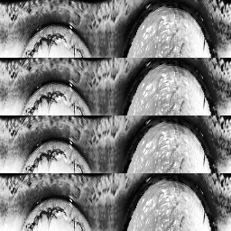

# iris_cnn

#### 介绍
虹膜图像分类，同时测试神经网络压缩相关技术

#### 软件架构
1.  enrollment_data是用于训练的数据集，test_data是测试用的数据集，他们都来自CASIA-Iris-Thousand数据集，取自其中的第750~999号受试者。预处理使用基于hought变换的虹膜定位方案(github实在放不下数据集，后续会上传到网盘链接：https://pan.baidu.com/s/1YtMLmAuPNY_28QyyYOSHQA 
提取码：b114)。通过极坐标展开将图像展开为256*64像素。再通过图像增强，拼接成256*256像素，得到最终的训练图像。训练集取7张，测试集取3张。图像预处理的效果如下：

2.  resnet18是标准的残差神经网络形式，224*224像素,三通道
3.  resnet8是简化版的残差神经网络，只保留了通道倍增的层，32*32像素,单通道
4.  ShuffleNet使用的是V2版本的残差单元
5.  quant1是resnet8的量化版
6.  quant2是ShufflenNet的量化版
7.  tool.py是一些工具函数
8.  data.py是制作数据集的函数，resnet18不用这个公共函数
9.  my_train.py是训练函数resnet18不使用这个函数
10.  my_test.py是跑测试集的函数resnet18不使用这个函数
11.  my_onnx.py是导出onnx模型的函数

#### 安装教程

能跑pytorch，有cuda就行

#### 测试结果
1.  模型大小和准确率如下表：

| 模型 | 大小/MB | 准确率/% | 运行速度/s |
| --- | --- | --- | --- |
| resnet18 | 44 | 94.5 |     |
| resnet8 | 19 | 97.9 |     |
| resnet8_q | 4.8 | 97.9 |     |
| shufflenet | 2 | 97.3 |     |
| shufflenet_q | 0.5 | 97.2 |     |

其中_q表示8bit量化版本，运行速度以跑10000张图片为基准

2.  测试结果表面对于这种深度预处理，特征十分明显的数据集，深层的神经网络未必会有更好的结果
3.  量化在压缩模型大小上有显著的效果，精度损失很小
4.  shufflenetV2 yyds !

#### 参考

1.  使用了学长提供的数据集，预处理程序是借鉴的开源程序，但是我并不知道是哪个，请知道的私信我一声
2.  时间太久远，resnet第一版的代码是用一个1000类32*32图片分类的resnet源码改过来的，具体是哪个大佬开源的我也忘了。
3.  参考了开源项目Pytorch
4.  感谢指导老师和三个学弟的帮助，没有你们我毕不了业
5.  感谢李宏毅老师和zomi酱的教学视频

